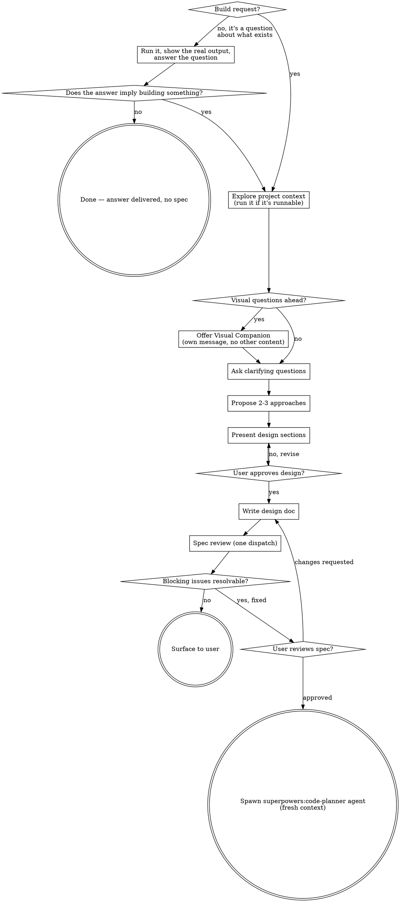

# Brainstorming Ideas Into Designs

Help turn ideas into fully formed designs and specs through natural collaborative dialogue.

Start by understanding the current project context, then ask questions one at a time to refine the idea. Once you understand what you're building, present the design and get user approval.

## First: Is This A Build Request?

Before anything else, decide which of these you were asked:

- **A question about what already exists** — "do confounds exist?", "which of these is slower?", "what does the data look like?", "is X currently handled?" → **Answer it.** Run the command, read the output, show the numbers. Then ask whether anything needs building. Terminating here with an answer and no spec is a **correct and complete** outcome for this skill.
- **A request to build, change, or add something** → continue with the design process below.

When it's ambiguous, get the answer first. An answer costs one command; a spec for a question you haven't answered costs a session. You cannot design well for output you have not seen.

<HARD-GATE>
Once you are doing creative work — building, changing, or adding behavior — do NOT invoke any implementation skill, write any code, scaffold any project, or take any implementation action until you have presented a design and the user has approved it. This applies regardless of perceived simplicity.
</HARD-GATE>

## Anti-Pattern: "This Is Too Simple To Need A Design"

Every *build* goes through this process. A todo list, a single-function utility, a config change — all of them. "Simple" projects are where unexamined assumptions cause the most wasted work. The design can be short (a few sentences for truly simple projects), but you MUST present it and get approval.

## Anti-Pattern: Designing Around Numbers You Haven't Seen

If the system can already produce the data, output, or behavior under discussion, **run it and look at the actual result before designing anything around it.** Never design a schema, persistence layer, threshold, classifier, or report for values you have not seen.

The tell: a design that has to say "we can't predict what these will be" or "the exact values will determine X." That sentence means you are working in the wrong order. Stop and go get them.

## Checklist

This checklist applies once you've determined it's a build request. You MUST create a task for each item and complete them in order:

1. **Explore project context** — check files, docs, recent commits. **If the system can already produce the data or behavior in question, run it and show the real output.**
2. **Offer visual companion** (if topic will involve visual questions) — this is its own message, not combined with a clarifying question. See the Visual Companion section below.
3. **Ask clarifying questions** — one at a time, understand purpose/constraints/success criteria
4. **Propose 2-3 approaches** — with trade-offs and your recommendation
5. **Present design** — in sections scaled to their complexity, get user approval after each section
6. **Write design doc** — save to `docs/specs/YYYY-MM-DD-<topic>-design.md` and commit. Add a "## Parallelization" section **only if** there are genuinely independent work streams (see below).
7. **Spec review** — dispatch spec-document-reviewer subagent exactly once, with precisely crafted review context (never your session history); fix the blocking issues and do not re-dispatch
8. **User reviews written spec** — ask user to review the spec file before proceeding
9. **Transition to implementation** — spawn a fresh-context `superpowers:code-planner` agent with only the design doc path

## Process Flow



**For a build request, the terminal state is spawning a `superpowers:code-planner` agent.** For a question about what already exists, the terminal state is the answer. Do NOT invoke writing-plans in the current session, frontend-design, mcp-builder, or any other implementation skill. The brainstorming session's context is polluted with exploration and Q&A — the plan writer needs fresh context with only the design doc.

## The Process

**Understanding the idea:**

- Check out the current project state first (files, docs, recent commits)
- Before asking detailed questions, assess scope: if the request describes multiple independent subsystems (e.g., "build a platform with chat, file storage, billing, and analytics"), flag this immediately. Don't spend questions refining details of a project that needs to be decomposed first.
- If the project is too large for a single spec, help the user decompose into sub-projects: what are the independent pieces, how do they relate, what order should they be built? Then brainstorm the first sub-project through the normal design flow. Each sub-project gets its own spec → plan → implementation cycle.
- For appropriately-scoped projects, ask questions one at a time to refine the idea
- Prefer multiple choice questions when possible, but open-ended is fine too
- Only one question per message - if a topic needs more exploration, break it into multiple questions
- Focus on understanding: purpose, constraints, success criteria

**Exploring approaches:**

- Propose 2-3 different approaches with trade-offs
- Present options conversationally with your recommendation and reasoning
- Lead with your recommended option and explain why

**Presenting the design:**

- Once you believe you understand what you're building, present the design
- Scale each section to its complexity: a few sentences if straightforward, up to 200-300 words if nuanced
- Ask after each section whether it looks right so far
- Cover: architecture, components, data flow, error handling, testing
- Be ready to go back and clarify if something doesn't make sense

**Design for isolation and clarity:**

- Break the system into smaller units that each have one clear purpose, communicate through well-defined interfaces, and can be understood and tested independently
- For each unit, you should be able to answer: what does it do, how do you use it, and what does it depend on?
- Can someone understand what a unit does without reading its internals? Can you change the internals without breaking consumers? If not, the boundaries need work.
- Smaller, well-bounded units are also easier for you to work with - you reason better about code you can hold in context at once, and your edits are more reliable when files are focused. When a file grows large, that's often a signal that it's doing too much.

**Working in existing codebases:**

- Explore the current structure before proposing changes. Follow existing patterns.
- Where existing code has problems that affect the work (e.g., a file that's grown too large, unclear boundaries, tangled responsibilities), include targeted improvements as part of the design - the way a good developer improves code they're working in.
- Don't propose unrelated refactoring. Stay focused on what serves the current goal.

## After the Design

**Parallelization (only when it exists):**

Most work is sequential, so most designs say nothing about parallelism and the plan comes out as a single step. Do not add a section to assert this — the absence of one already means it.

Write about parallelism only when the design genuinely contains **separate subsystems that different people could build at the same time without talking to each other.** That is a high bar: separate branches, separate worktrees, separate sessions. "These two functions don't depend on each other" is not parallelism — it's just two commits.

When the bar is genuinely met, say what the shared foundation is, which streams are independent once it exists, and what has to wait for all of them:

```markdown
## Parallelization

The data models and shared types are foundational — everything depends on them.
Once those exist, the API layer, background workers, and UI can be built independently.
They communicate through the data models only, no direct coupling.
Integration tests should run after all three are merged.
```

The code-planner translates such a section into a DAG roadmap. Inventing parallelism here forces a multi-step DAG downstream that costs more to coordinate than the work saves.

**Documentation:**

- Write the validated design (spec) to `docs/specs/YYYY-MM-DD-<topic>-design.md`
  - (User preferences for spec location override this default)
- Use elements-of-style:writing-clearly-and-concisely skill if available
- Commit the design document to git

**Spec Review (exactly one dispatch):**
After writing the spec document:

1. Dispatch the spec-document-reviewer subagent (see spec-document-reviewer-prompt.md). The user's invocation of this skill is the request for this dispatch — perform it without asking.
2. Fix the blocking issues. Evaluate them rather than implementing them blindly; if you reject a finding, say which and why.
3. **Do not re-dispatch to re-check your own fixes.** If a blocking issue can't be resolved, surface it to the user instead.

One dispatch per version of the spec, not a loop. A second pass on a spec the reviewer has already seen re-checks your own fixes, which is what you already do without being told, and reliably opens new categories of issue rather than confirming the old ones. A spec is not code; residual imperfection in it is cheaper to fix during implementation than to iterate out beforehand.

A spec the *user* substantively revises is new material, not a re-check — that gets its own single dispatch.

**User Review Gate:**
After the spec review, ask the user to review the written spec before proceeding:

> "Spec written and committed to `<path>`. Please review it and let me know if you want to make any changes before we start writing out the implementation plan."

Wait for the user's response. If they request changes, make them and dispatch the spec reviewer once on the revised spec. Only proceed once the user approves.

**Implementation:**

Spawn a `superpowers:code-planner` agent with fresh context. Do NOT invoke `/writing-plans` in the current session — the context window is full of exploration and back-and-forth that the plan writer doesn't need.

```
Agent:
  subagent_type: superpowers:code-planner
  prompt: |
    Write an implementation plan from the design doc at <design-doc-path>.
    Worktree: <existing-worktree-path, or omit this line entirely>
```

Only include the `Worktree:` line if an isolated worktree **already exists** for this work. Do not create one here — the worktree is set up at execution time by `superpowers:executing-plans` (its Step 0). Planning does not need a worktree, so omitting the line is the normal case.

The agent will read the design doc (its only input), explore the codebase independently, write the plan, split into sub-step files if needed, and present execution options to the user.

- Do NOT summarize the brainstorming conversation for the agent — it should start fresh
- Do NOT invoke any other skill. The `superpowers:code-planner` agent is the next step.

## Key Principles

- **Answer questions, don't spec them** - If the ask is about what already exists, the deliverable is the answer
- **Look before you design** - Run the thing, see the real output, then design around it
- **One question at a time** - Don't overwhelm with multiple questions
- **Multiple choice preferred** - Easier to answer than open-ended when possible
- **YAGNI ruthlessly** - Remove unnecessary features from all designs
- **Proportionality** - The spec should be shorter than the change it describes. A 600-line spec for a 200-line diff is a defect, not thoroughness
- **Cite paths, never line numbers** - `src/audit.py` is stable; `src/audit.py:412` goes stale within a single task and then costs review rounds to maintain. Citation density is not rigor
- **Explore alternatives** - Always propose 2-3 approaches before settling
- **Incremental validation** - Present design, get approval before moving on
- **Be flexible** - Go back and clarify when something doesn't make sense

## Visual Companion

A browser-based companion for showing mockups, diagrams, and visual options during brainstorming. Available as a tool — not a mode. Accepting the companion means it's available for questions that benefit from visual treatment; it does NOT mean every question goes through the browser.

**Offering the companion:** When you anticipate that upcoming questions will involve visual content (mockups, layouts, diagrams), offer it once for consent:
> "Some of what we're working on might be easier to explain if I can show it to you in a web browser. I can put together mockups, diagrams, comparisons, and other visuals as we go. This feature is still new and can be token-intensive. Want to try it? (Requires opening a local URL)"

**This offer MUST be its own message.** Do not combine it with clarifying questions, context summaries, or any other content. The message should contain ONLY the offer above and nothing else. Wait for the user's response before continuing. If they decline, proceed with text-only brainstorming.

**Per-question decision:** Even after the user accepts, decide FOR EACH QUESTION whether to use the browser or the terminal. The test: **would the user understand this better by seeing it than reading it?**

- **Use the browser** for content that IS visual — mockups, wireframes, layout comparisons, architecture diagrams, side-by-side visual designs
- **Use the terminal** for content that is text — requirements questions, conceptual choices, tradeoff lists, A/B/C/D text options, scope decisions

A question about a UI topic is not automatically a visual question. "What does personality mean in this context?" is a conceptual question — use the terminal. "Which wizard layout works better?" is a visual question — use the browser.

If they agree to the companion, read the detailed guide before proceeding:
`skills/brainstorming/visual-companion.md`
