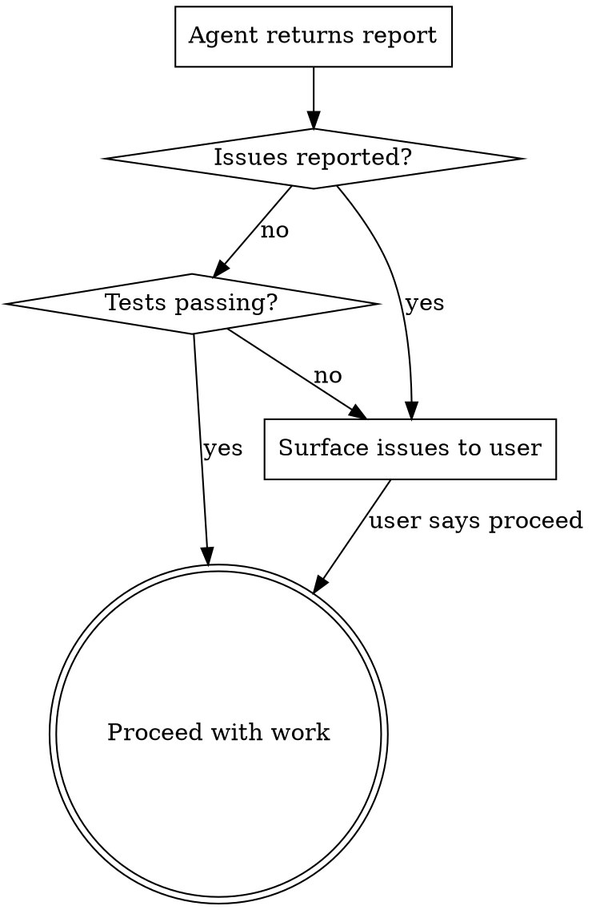

# Using Git Worktrees

## Overview

Git worktrees create isolated workspaces sharing the same repository, allowing work on multiple branches simultaneously without switching.

**Core principle:** Delegate setup to a subagent so mechanical work doesn't pollute your context.

**Announce at start:** "I'm using the using-git-worktrees skill to set up an isolated workspace."

## Setup: Dispatch the Worktree-Setup Agent

Spawn a `worktree-setup` agent to handle all mechanical setup work:

```
Agent:
  subagent_type: worktree-setup
  description: "Set up worktree for <branch>"
  prompt: "Set up a worktree for branch <BRANCH_NAME> in repo <REPO_ROOT>"
```

The agent handles: directory detection, gitignore verification, worktree creation, dependency installation, and test baseline — then returns a structured report.

## Handle the Report

The agent returns a report with: **Path**, **Branch**, **Tests**, **Issues**, and **Decisions**.



- **No issues, tests passing:** Proceed with implementation
- **Tests failing:** Report to user, ask whether to proceed or investigate
- **Setup issues (gitignore fixed, dep warnings):** Note them but proceed unless they look serious

## Cleanup

**Worktree cleanup order** (always, no exceptions):

```bash
cd <main-repo>
git worktree remove <path>
git branch -d <branch>
```

Never delete the branch before removing the worktree.

## Integration

**Called by:**
- **executing-plans** — REQUIRED before executing any tasks
- Any skill needing isolated workspace

**Pairs with:**
- **finishing-a-development-branch** — REQUIRED for cleanup after work complete
